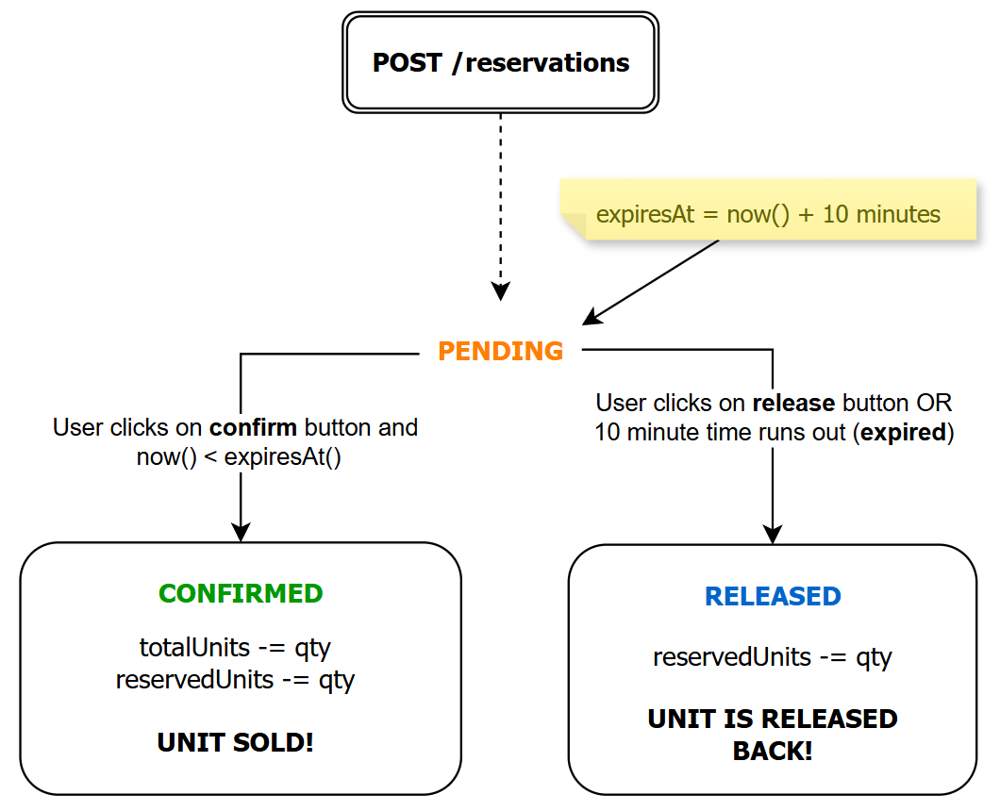

# AlloShoppe - Shopping Platform - Take Home Project

A reservation-based order fulfillment and inventory platform that's built for multi-warehouse retail and D2C. Built as a take-home exercise for Allo Health.

**Live Demo:** [allo-inventory-six-eta.vercel.app](https://allo-inventory-six-eta.vercel.app)

---

## Overview

AlloShoppe manages stock across multiple warehouses for various products using a **reservation** technique. The goal of reservation is to ensure units are held (locked) for 10 minutes and released if checkout isn't completed by then, or if the user chooses to unreserve the product. 

For easy visualization of reserved, expired and sold products, an admin dashboard* has been included. 

<div align="center">
  
</div>

*_The admin dashboard is kept accessible to all as a user data model has not been created for this project._

---

## Tech Stack
 
| Layer | Choice |
|---|---|
| Framework | Next.js 16.2.6 (App Router, TypeScript) |
| Database | PostgreSQL (Neon) |
| ORM | Prisma 7.8.0 |
| Hosting | Vercel |
| Styling | Tailwind CSS |
| Validation | Zod |

---

## Data Model

### Tables
 
**Product** - one row per stock keeping unit (SKU). It stores name, price, weight, category, and image.
 
**Warehouse** - one row per physical location. Stores delivery base fee and per-kg rate for delivery fee calculation alongside product weight.
 
**Stock** - junction between Product and Warehouse. It stores `totalUnits` and `reservedUnits`. Available units are computed (`totalUnits - reservedUnits`), not stored. 
 
**Reservation** - one row per checkout attempt. Tracks status (`PENDING`, `CONFIRMED`, `RELEASED`), quantity, and expiry time.

Apart from the tables, there are two enums, "Category" and "ReservationStatus" that hold the different product categories and the possible product reservation statuses respectively.

The schema is managed with Prisma and lives in `prisma/schema.prisma`.

<div align="center">
  
</div>

---

## Reservation Lifecycle

Once the user reserves X units of a product from a given warehouse, a entry is made in the reservation table, PENDING status is assigned and expiry time set to 10 minutes from the time the order was placed.

The user can either "Confirm Purchase" or "Cancel Reservation" before the timer runs out. The flow for both is shown below.

<div align="center">
  
</div>

If the user fails to choose either option (exits tab, navigates elsewhere), the units are released once they are expired (via expiry mechanisms listed below). 

## Expiry Mechanism

Expired reservations are handled in two ways:

### 1. Lazy Cleanup (MAIN)

The `lazyCleanup()` utility in `lib/lazyCleanup.ts` finds all `PENDING` reservations where `expiresAt < now`, releases them, and decrements `reservedUnits` on the corresponding stock rows.

This runs inline on every `GET /api/products` and request as well as `GET /api/admin/stats`. Therefore the counts are always accurate when shoppers access the products page or admins page. 

### 2. Vercel Cron (DAILY SWEEP*)

A cron job runs once daily at midnight via Vercel Cron, hitting `/api/cron/expire-reservations`. This acts as a guaranteed cleanup sweep, catching any reservations that may have been missed between product page loads.

*_It was originally set to run every minute, but changed it to daily once due to vercel usage limits._

```json
{
  "crons": [{
    "path": "/api/cron/expire-reservations",
    "schedule": "0 0 * * *"
  }]
}
```

The endpoint is protected by a `CRON_SECRET` bearer token to prevent unauthorized calls.


---

## Approach to Achieve Concurrency

When two requests arrive simultaneously for the last unit, I have used PostgreSQL's row-level locking inside a transaction (`FOR UPDATE`).

```sql
SELECT * FROM "Stock" WHERE "stockId" = $1 FOR UPDATE
```

Using `FOR UPDATE` means no other request can read or touch that row until the current transaction completes. The second request blocks at the lock, waits, then reads the already decremented stock and correctly returns 409.

Everything runs inside a Prisma `$transaction`. In case anything fails mid-way, the entire operation rolls back.

The same locking pattern is applied to the Reservation row in the confirm and release endpoints, preventing a simultaneous confirm and cancel from leaving stock in an inconsistent state.

---

## API Reference

### Products & Warehouses

| Method | Path | Description |
|---|---|---|
| GET | `/api/products` | Returns all products with per-warehouse stock, available units, and computed delivery fee |
| GET | `/api/warehouses` | Returns all warehouses with delivery rates |

### Reservations

| Method | Path | Status Codes |
|---|---|---|
| POST | `/api/reservations` | Creates a reservation, returns `201` on created, `409` on insufficient stock, `400` on invalid body |
| GET | `/api/reservations/:id` | Gets a single reservation with product and warehouse details, returns `200` on found, `404` on not found |
| POST | `/api/reservations/:id/confirm` | Confirms a reservation (checked out), returns 410 if expired |
| POST | `/api/reservations/:id/release` | Release reservation early |

### Admin

| Method | Path | Description |
|---|---|---|
| GET | `/api/admin/reservations` | All reservations with product and warehouse details, ordered by newest first |
| GET | `/api/admin/stats` | Aggregate stats - counts by status, available units, confirmed revenue |

### Cron

| Method | Path | Description |
|---|---|---|
| GET | `/api/cron/expire-reservations` | Releases expired PENDING reservations. Called automatically by Vercel Cron every day* |

*_Vercel limits cron jobs to only once a day. More about the lazy cleanup function used is explained above._

---

## Local Setup
 
### Prerequisites
 
- Node.js 18+
- A Neon account

### Steps
 
**1. Clone the repository**
 
```bash
git clone https://github.com/Kriyasri-Harikrishnan/allo-inventory
cd allo-inventory
```
 
**2. Install dependencies**
 
```bash
npm install
```
 
**3. Set up environment variables**
 
Create a `.env` file in the project root.
 
```
DATABASE_URL="your-neon-connection-string"
CRON_SECRET="some-random-string"
```
 
**4. Push the prisma schema to your database**
 
```bash
npx prisma db push
npx prisma generate
```
 
**5. Seed the database**
 
```bash
npx prisma db seed
```
 
This creates 3 warehouses (Chennai, Bangalore, Hyderabad), 6 products across all categories, and 18 stock entries with varying quantities.
 
**6. Start the development server**
 
```bash
npm run dev
```
 
Visit `http://localhost:3000`
 
> **Note:** The Vercel Cron job does not run locally, call the endpoint manually to test it in dev mode:
>
> ```
> GET /api/cron/expire-reservations
> Authorization: Bearer YOUR_CRON_SECRET
> ```

---

## Seed Data

The seed script `prisma/seed.ts` is used to populate the database with sample data. It has 3 warehouses, 6 products across all categories, and 18 stock entries.

### Products
 
| Product | Category | Price |
|---|---|---|
| Chunky Wireless Headphones | ELECTRONICS | ₹2,999.99 |
| Cotton Crew T-Shirt | APPAREL | ₹499.99 |
| Athletic Running Sneakers | FOOTWEAR | ₹1,999.99 |
| Yoga Mat | SPORTS_AND_FITNESS | ₹799.99 |
| Desk Lava Lamp | HOME_AND_LIVING | ₹899.99 |
| Curology Daily Cleanser Set | BEAUTY | ₹349.99 |
  
### Warehouses
 
| Warehouse | Location | Base Fee | Per Kg |
|---|---|---|---|
| Chennai Hub | Chennai, TN | ₹39.00 | ₹9.00 |
| Bangalore Central | Bengaluru, KA | ₹45.00 | ₹10.00 |
| Hyderabad South | Hyderabad, TS | ₹42.00 | ₹11.00 |

---

## Trade-offs and Known Limitations

**No authentication** - Reservations are not tied to a user session as no user model was designed. In real production, reservations would be associated with authenticated users and endpoints would verify ownership before allowing confirm or release actions.

**Cron Cycle** - Due to Vercel free tier limits the cron job runs once daily instead of every minute. Lazy cleanup on product and admin page load compensates for this in the demo.

**Delivery fee is not distance-based, it is fixed** - Delivery fee is computed from the warehouse base rate and product weight. In production, a pincode distance API would make this dynamic based on users actual location.

**No payment integration** - The confirm endpoint simulates payment success via a button click, does not have a real payment gateway flow (Razorpay etc).

**No idempotency keys** - If a client retries after a network failure, a duplicate reservation may be created. 

---

## What I Would Have Done With More Time

- [ ] User profiles and authentication - associate reservations with logged-in users, verify ownership before confirm/release
- [ ] Location-based delivery fee - integrate a distance API using user pincode and warehouse location
- [ ] Payment gateway integration - trigger confirm via a real payment webhook instead of a button click
- [ ] Idempotency keys - store request hashes in Redis with a 24-hour TTL, return cached responses on retry to prevent duplicate reservations
- [ ] Admin panel authentication - restrict `/admin` to internal users only
